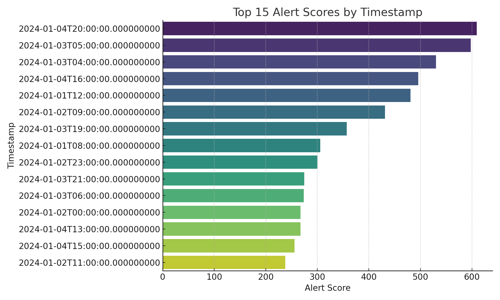
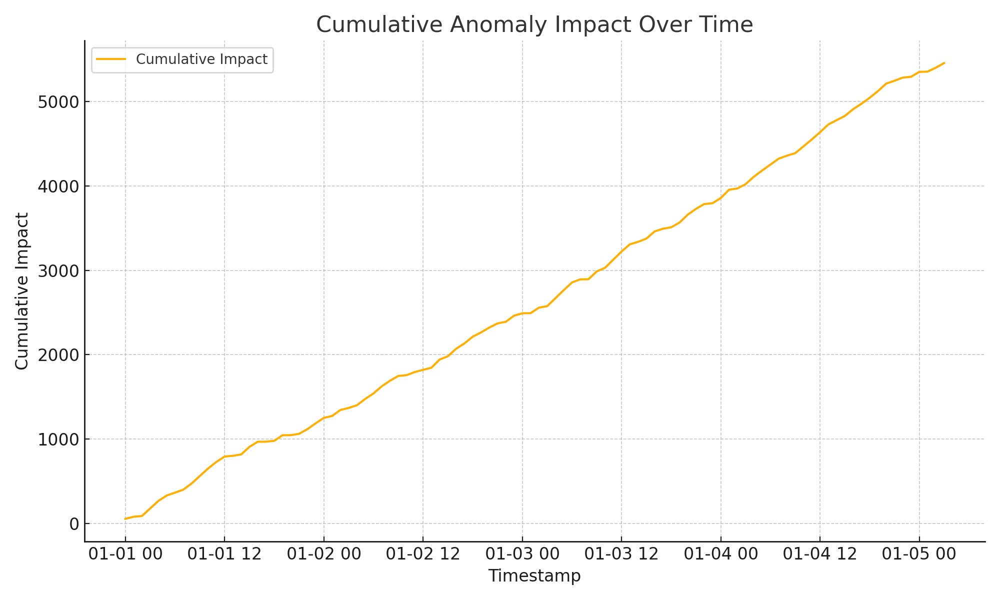
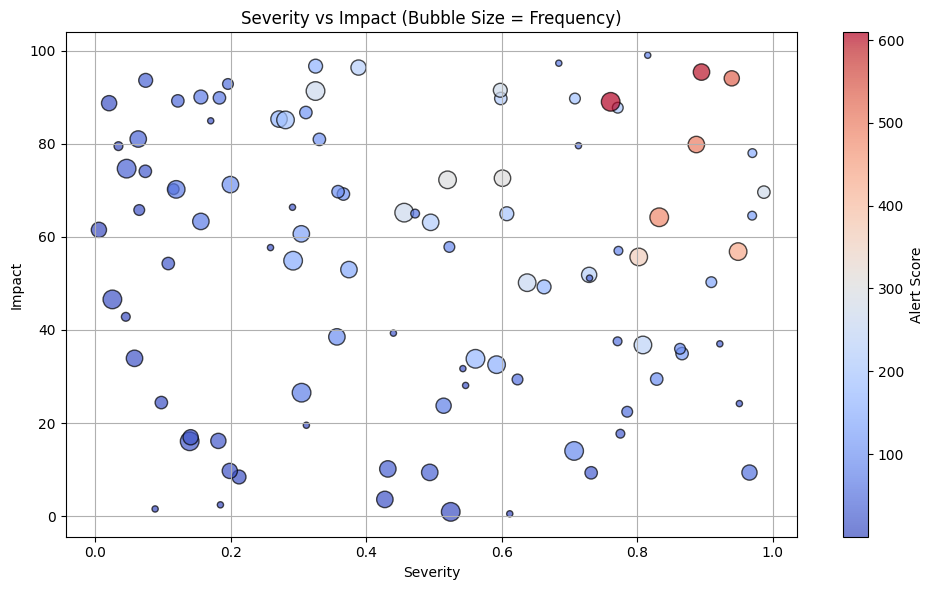
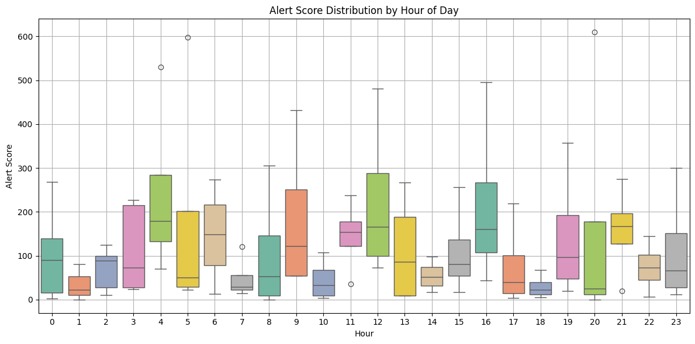

# alert_prioritization_scoring
Ranking Anomalies with Smart Alert Prioritization: A Heuristic-Based Scoring Approach.This project implements a simple yet effective heuristic to prioritize alerts in time-series anomaly data using:

- **Severity**
- **Frequency**
- **Impact**

We score each alert using the formula:
```
Alert Score = Severity × Frequency × Impact
```


This helps reduce alert fatigue by focusing on **high-risk, high-impact anomalies**.

---

## Visualizations

### 1.Severity Heatmap
Visualizes the average anomaly severity across different hours of each day.


---

### 2.Top Alerts by Score
Bar plot of the top 15 highest scoring alerts.



---

### 3.Cumulative Impact Over Time
Tracks how the total impact from anomalies builds up.



---

### 4.Severity vs Impact (Bubble = Frequency)
Scatter plot showing how severe and impactful anomalies relate, with bubble size based on frequency.



---

### 5.Alert Score Distribution by Hour
Boxplot to reveal which hours of the day tend to produce high-scoring alerts.



---

## 📁 Files

- `alert_prioritization_scoring.ipynb` – Full code and explanations
- `alert_prioritization_data.csv` – Simulated dataset

---

## 🧠 When to Use This
This rule-based system is perfect for:
- Early-stage anomaly systems
- Scenarios without labeled data
- Complementing ML/NLP alert triage systems

---

## ✅ Next Steps
- Add anomaly classification
- Include domain-specific weights
- Integrate into dashboards (e.g., Streamlit, Grafana)

## 👨‍💻 Author
**Raj Kumar Myakala**  
AI | Data | Automation | GCP | Python  
[LinkedIn ](https://www.linkedin.com/in/raj-kumar-myakala-927860264/)  
[GitHub ](https://github.com/rajkumar160798)

---

>  If you like this project, consider starring the repo and following my GitHub for more AI/ML innovations!
